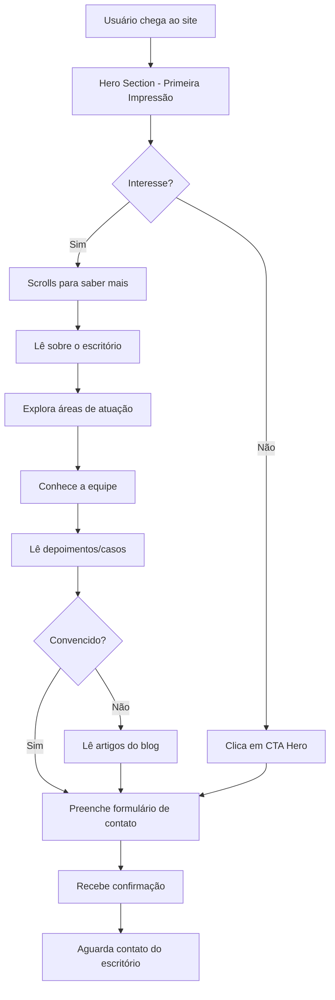

# 🏛️ Portfólio para Advogados - Planejamento Completo

## 📋 Visão Geral do Projeto

Site institucional moderno e profissional para escritório de advocacia, focado em transmitir credibilidade, profissionalismo e excelência jurídica. O design priorizará clareza, elegância e usabilidade, refletindo os valores da advocacia.

---

## 🎯 Objetivos do Projeto

### Primários
- ✅ Apresentar o escritório e seus advogados de forma profissional
- ✅ Destacar áreas de atuação e expertise jurídica
- ✅ Facilitar contato de clientes potenciais
- ✅ Transmitir credibilidade e confiança

### Secundários
- ✅ Exibir casos de sucesso e depoimentos
- ✅ Fornecer conteúdo educativo (artigos/blog)
- ✅ Otimização para SEO e conversão
- ✅ Responsividade total (mobile-first)

---

## 🎨 Identidade Visual & UX/UI

### Paleta de Cores
```css
/* Cores Principais */
--primary-dark: #1a1a2e;      /* Azul escuro profissional */
--primary-gold: #c9a961;      /* Dourado elegante (destaque) */
--accent-blue: #2c5f7d;       /* Azul corporativo */

/* Cores Secundárias */
--white: #ffffff;             /* Branco puro */
--light-gray: #f4f4f4;        /* Fundo suave */
--medium-gray: #6c757d;       /* Texto secundário */
--dark-gray: #2d2d2d;         /* Texto principal */

/* Cores de Estado */
--success: #28a745;           /* Sucesso */
--error: #dc3545;             /* Erro */
--warning: #ffc107;           /* Aviso */
```

### Tipografia
```css
/* Fontes Principais */
--font-heading: 'Playfair Display', serif;  /* Títulos elegantes */
--font-body: 'Inter', sans-serif;            /* Corpo de texto moderno */
--font-accent: 'Crimson Text', serif;        /* Destaques especiais */

/* Tamanhos */
--h1: 3.5rem;      /* Hero titles */
--h2: 2.5rem;      /* Section titles */
--h3: 1.75rem;     /* Subsections */
--body: 1rem;      /* Texto padrão */
--small: 0.875rem; /* Texto pequeno */
```

### Princípios de Design

#### 🎭 Tom & Personalidade
- **Profissional**: Design limpo e organizado
- **Confiável**: Uso de cores sóbrias e tipografia clássica
- **Moderno**: Animações sutis e layout contemporâneo
- **Acessível**: Contraste adequado e navegação intuitiva

#### 📐 Layout
- **Espaçamento**: Generoso (respiração visual)
- **Grid**: 12 colunas responsivo
- **Containers**: Max-width 1200px (conteúdo)
- **Seções**: Altura mínima de viewport para impacto visual

#### ✨ Microinterações
- Hover effects suaves em botões e cards
- Transições de 300ms para feedback visual
- Scroll animations com Intersection Observer
- Parallax sutil em hero sections

---

## 📁 Estrutura de Pastas

```
portfolio-advogados/
│
├── index.html                 # Página principal
│
├── assets/
│   ├── css/
│   │   ├── reset.css         # Reset CSS moderno
│   │   ├── variables.css     # Variáveis CSS (cores, fontes, etc)
│   │   ├── global.css        # Estilos globais
│   │   ├── components.css    # Componentes reutilizáveis
│   │   └── sections.css      # Estilos específicos de seções
│   │
│   ├── js/
│   │   ├── main.js           # Inicialização e orquestração
│   │   ├── navigation.js     # Menu e navegação
│   │   ├── animations.js     # Animações e scroll effects
│   │   ├── form.js           # Validação e envio de formulário
│   │   └── utils.js          # Funções utilitárias
│   │
│   ├── images/
│   │   ├── logo/             # Logos do escritório
│   │   ├── team/             # Fotos dos advogados
│   │   ├── hero/             # Imagens de hero section
│   │   ├── icons/            # Ícones customizados
│   │   └── backgrounds/      # Imagens de fundo
│   │
│   └── fonts/                # Fontes locais (fallback)
│
├── README.md                 # Documentação do projeto
└── .gitignore               # Arquivos ignorados pelo Git
```

---

## 🧩 Componentes do Sistema

### 1. **Header/Navbar** 🔝
**Funcionalidade**: Navegação principal fixa com scroll behavior

**Elementos**:
- Logo do escritório (esquerda)
- Menu de navegação (direita)
- Botão CTA "Consulta Gratuita"
- Menu mobile (hamburguer)

**Estados**:
- `Default`: Transparente no topo
- `Scrolled`: Fundo sólido com sombra
- `Mobile Menu Open`: Overlay full-screen

**UX/UI**:
- Sticky position com transição suave
- Highlight no link da seção ativa
- Animação de entrada suave

---

### 2. **Hero Section** 🎯
**Funcionalidade**: Primeira impressão impactante

**Elementos**:
- Headline principal + subtítulo
- Breve descrição do escritório
- 2 CTAs: "Agendar Consulta" + "Conhecer Equipe"
- Imagem/vídeo de background (paralax)

**UX/UI**:
- Full viewport height
- Overlay escuro sobre imagem (legibilidade)
- Animação de fade-in ao carregar
- Scroll indicator (mouse animation)

---

### 3. **About Section** 📖
**Funcionalidade**: Apresentação do escritório

**Elementos**:
- História do escritório
- Missão, Visão e Valores
- Diferenciais competitivos
- Números/estatísticas (anos de experiência, casos ganhos, etc)

**Layout**:
- Grid 2 colunas (desktop)
- Texto à esquerda, imagem/stats à direita
- Counter animations nos números

---

### 4. **Practice Areas Section** ⚖️
**Funcionalidade**: Áreas de atuação jurídica

**Elementos**:
- Grid de cards (3 colunas)
- Ícone + Título + Descrição breve
- Link "Saiba mais" em cada card

**Áreas Sugeridas**:
- Direito Civil
- Direito Trabalhista
- Direito Criminal
- Direito de Família
- Direito Empresarial
- Direito Imobiliário

**UX/UI**:
- Hover effect: elevação e mudança de cor
- Ícones customizados ou FontAwesome
- Stagger animation ao aparecer na viewport

---

### 5. **Team Section** 👥
**Funcionalidade**: Apresentação dos advogados

**Elementos**:
- Grid de cards com foto profissional
- Nome + OAB + Especialização
- Mini biografia
- Links sociais (LinkedIn, email)

**Layout**:
- Cards uniformes com foto circular ou quadrada
- Overlay com informações ao hover
- Modal com biografia completa (opcional)

**UX/UI**:
- Fotos profissionais em preto e branco
- Transição suave ao hover
- Responsivo (1-2-3 colunas)

---

### 6. **Testimonials Section** 💬
**Funcionalidade**: Depoimentos de clientes

**Elementos**:
- Carrossel de depoimentos
- Foto do cliente (opcional)
- Nome + Caso
- Citação em destaque
- Rating de 5 estrelas

**UX/UI**:
- Slider com navegação (setas + bullets)
- Auto-play com pausa ao hover
- Background diferenciado (ex: cinza claro)
- Aspas decorativas

---

### 7. **Success Cases Section** 🏆
**Funcionalidade**: Casos de sucesso (sem violar sigilo)

**Elementos**:
- Timeline de casos relevantes
- Categoria + Resultado
- Descrição resumida
- Ano

**UX/UI**:
- Design de timeline vertical
- Animação ao scroll
- Filtro por área de atuação (opcional)

---

### 8. **Blog/Articles Section** 📰
**Funcionalidade**: Conteúdo educativo e SEO

**Elementos**:
- Grid de artigos recentes (3 últimos)
- Thumbnail + Título + Resumo
- Data de publicação
- Link "Ler mais"
- CTA "Ver todos os artigos"

**UX/UI**:
- Cards com imagem de destaque
- Hover: elevação suave
- Tag de categoria colorida

---

### 9. **Contact Section** 📞
**Funcionalidade**: Formulário de contato + informações

**Elementos**:

**Coluna Esquerda - Formulário**:
- Nome completo
- Email
- Telefone
- Área de interesse (dropdown)
- Mensagem (textarea)
- Checkbox LGPD/consentimento
- Botão "Enviar Mensagem"

**Coluna Direita - Informações**:
- Endereço físico do escritório
- Telefone(s)
- Email
- Horário de atendimento
- Mapa integrado (Google Maps embed)

**UX/UI**:
- Validação em tempo real
- Mensagens de erro claras
- Feedback visual no envio
- Ícones ao lado de cada informação
- Background pattern sutil

---

### 10. **Footer** 🔻
**Funcionalidade**: Informações complementares e links

**Elementos**:

**Seção 1 - Sobre**:
- Logo
- Breve descrição
- Selos/certificações

**Seção 2 - Links Rápidos**:
- Navegação principal
- Áreas de atuação
- Blog

**Seção 3 - Contato**:
- Endereço
- Telefone
- Email
- Redes sociais

**Seção 4 - Newsletter** (opcional):
- Input de email
- Botão "Inscrever"

**Bottom Bar**:
- Copyright
- Links: Política de Privacidade | Termos de Uso
- Desenvolvido por [seu nome]

---

## ⚙️ Funcionalidades JavaScript

### 1. **Navigation Module** (`navigation.js`)
```javascript
/**
 * Gerenciamento da navegação principal
 * - Smooth scroll para seções
 * - Highlight do link ativo
 * - Menu mobile toggle
 * - Navbar behavior no scroll
 */
```

**Funções**:
- `initNavigation()`: Inicializa todos os listeners
- `smoothScrollTo(target)`: Scroll suave para seção
- `updateActiveLink()`: Atualiza link ativo baseado na posição
- `toggleMobileMenu()`: Abre/fecha menu mobile
- `handleNavbarScroll()`: Muda aparência do navbar ao scroll

---

### 2. **Animations Module** (`animations.js`)
```javascript
/**
 * Animações e efeitos visuais
 * - Scroll animations (fade-in, slide-up)
 * - Counter animations para estatísticas
 * - Parallax effects
 */
```

**Funções**:
- `initScrollAnimations()`: Intersection Observer para elementos
- `animateCounters()`: Anima números de estatísticas
- `initParallax()`: Efeito parallax em hero section

---

### 3. **Form Module** (`form.js`)
```javascript
/**
 * Validação e envio de formulário de contato
 * - Validação em tempo real
 * - Feedback visual
 * - Integração com API/email
 */
```

**Funções**:
- `initFormValidation()`: Listeners de validação
- `validateField(field)`: Valida campo individual
- `handleFormSubmit(event)`: Processa envio do formulário
- `showFeedback(type, message)`: Exibe mensagem de sucesso/erro

---

### 4. **Utils Module** (`utils.js`)
```javascript
/**
 * Funções utilitárias reutilizáveis
 * - Debounce/throttle
 * - Detecção de viewport
 * - Helpers gerais
 */
```

**Funções**:
- `debounce(func, wait)`: Debounce para eventos
- `isInViewport(element)`: Verifica se elemento está visível
- `isMobile()`: Detecta dispositivo mobile

---

## 🎬 Fluxo de Interação do Usuário

### Jornada Principal



---

## 📱 Responsividade - Breakpoints

```css
/* Mobile First Approach */

/* Extra Small - Smartphones */
@media (max-width: 575px) {
  /* 1 coluna, menu hamburguer, hero simplificado */
}

/* Small - Tablets Portrait */
@media (min-width: 576px) and (max-width: 767px) {
  /* 2 colunas onde possível */
}

/* Medium - Tablets Landscape */
@media (min-width: 768px) and (max-width: 991px) {
  /* Menu visível, grid 2-3 colunas */
}

/* Large - Desktops */
@media (min-width: 992px) and (max-width: 1199px) {
  /* Layout completo, 3-4 colunas */
}

/* Extra Large - Large Desktops */
@media (min-width: 1200px) {
  /* Layout otimizado, max-width container */
}
```

---

## 🚀 Performance & Otimização

### Imagens
- ✅ Formatos modernos: WebP com fallback JPEG
- ✅ Lazy loading para imagens abaixo da dobra
- ✅ Responsive images com `srcset`
- ✅ Compressão adequada (TinyPNG/ImageOptim)

### CSS
- ✅ Minificação em produção
- ✅ Critical CSS inline no `<head>`
- ✅ CSS não-crítico com `defer`
- ✅ Evitar CSS não utilizado

### JavaScript
- ✅ Modular e carregamento assíncrono
- ✅ Minificação e bundling
- ✅ Defer/async scripts não-críticos
- ✅ Event delegation

### Fontes
- ✅ Google Fonts com `display=swap`
- ✅ Preconnect para domínios externos
- ✅ Subset de caracteres (apenas necessários)

---

## ♿ Acessibilidade (WCAG 2.1)

### Checklist
- ✅ Contraste adequado (AAA quando possível)
- ✅ Textos alternativos em imagens
- ✅ Navegação por teclado funcional
- ✅ Focus indicators visíveis
- ✅ ARIA labels onde necessário
- ✅ Hierarquia semântica de headings
- ✅ Formulários com labels adequados
- ✅ Skip to content link

---

## 🔍 SEO - Otimização

### On-Page
```html
<!-- Meta Tags Essenciais -->
<title>Escritório [Nome] - Advocacia em [Cidade] | Especialistas em [Área]</title>
<meta name="description" content="Escritório de advocacia em [Cidade] com [X] anos de experiência. Especialistas em [áreas]. Agende uma consulta gratuita.">
<meta name="keywords" content="advogado, advocacia, [cidade], [especialidades]">

<!-- Open Graph -->
<meta property="og:title" content="...">
<meta property="og:description" content="...">
<meta property="og:image" content="...">
<meta property="og:url" content="...">

<!-- Schema.org Markup -->
<script type="application/ld+json">
{
  "@context": "https://schema.org",
  "@type": "LegalService",
  "name": "Escritório [Nome]",
  "address": {...},
  "telephone": "...",
  "openingHours": "...",
  "priceRange": "$$"
}
</script>
```

### Estrutura
- ✅ URLs semânticas e descritivas
- ✅ Sitemap.xml
- ✅ Robots.txt
- ✅ Canonical tags
- ✅ Estrutura de headings correta (H1 único)

---

## 📊 Analytics & Conversão

### Tracking
- **Google Analytics 4**: Eventos personalizados
  - Cliques em CTAs
  - Envio de formulário
  - Scroll depth
  - Tempo na página

### Conversões Principais
1. Formulário de contato preenchido
2. Clique em número de telefone
3. Clique em WhatsApp
4. Download de materiais (se houver)

---

## 🔐 LGPD & Privacidade

### Requisitos
- ✅ Banner de consentimento de cookies
- ✅ Política de privacidade detalhada
- ✅ Termos de uso
- ✅ Checkbox explícito no formulário
- ✅ Criptografia SSL (HTTPS)
- ✅ Armazenamento seguro de dados

---

## 🛠️ Tecnologias & Dependências

### Core
- HTML5 semântico
- CSS3 (Custom Properties, Grid, Flexbox)
- JavaScript ES6+ (Modules)

### Bibliotecas Externas (CDN)
```html
<!-- Fontes -->
<link href="https://fonts.googleapis.com/css2?family=Playfair+Display:wght@400;700&family=Inter:wght@300;400;600;700&display=swap" rel="stylesheet">

<!-- Ícones -->
<link rel="stylesheet" href="https://cdnjs.cloudflare.com/ajax/libs/font-awesome/6.4.0/css/all.min.css">

<!-- Animações (opcional) -->
<link rel="stylesheet" href="https://unpkg.com/aos@next/dist/aos.css" />
<script src="https://unpkg.com/aos@next/dist/aos.js"></script>
```

### Ferramentas de Desenvolvimento
- VS Code
- Live Server (desenvolvimento local)
- Git/GitHub (versionamento)

---

## 📝 Notas de Implementação

### Fase 1: Setup
1. Criar estrutura de pastas
2. Setup de arquivos base (HTML, CSS, JS)
3. Configurar variáveis CSS
4. Implementar reset e estilos globais

### Fase 2: Componentes
1. Header/Navbar
2. Hero Section
3. About Section
4. Practice Areas

### Fase 3: Conteúdo
1. Team Section
2. Testimonials
3. Success Cases
4. Blog preview

### Fase 4: Interação
1. Contact Form
2. Footer
3. JavaScript modules
4. Animações

### Fase 5: Polimento
1. Responsividade
2. Performance
3. Acessibilidade
4. SEO

### Fase 6: Testes
1. Cross-browser testing
2. Responsividade em devices reais
3. Validação W3C
4. Lighthouse audit

---

## 🎨 Referências de Design

### Inspirações
- Awwwards.com (sites jurídicos premiados)
- Dribbble (law firm designs)
- Behance (legal services)

### Exemplos de Excelência
- Layout limpo e profissional
- Uso estratégico de espaço em branco
- Tipografia elegante e legível
- CTAs bem posicionados
- Navegação intuitiva

---

## 📌 Checklist Final

### Qualidade de Código
- [ ] HTML validado (W3C)
- [ ] CSS validado
- [ ] JavaScript sem erros no console
- [ ] Comentários claros e em português
- [ ] Código indentado e organizado

### Funcionalidade
- [ ] Todos os links funcionam
- [ ] Formulário valida e envia
- [ ] Menu mobile funcional
- [ ] Animações suaves
- [ ] Cross-browser compatível

### Design
- [ ] Consistência visual
- [ ] Responsivo em todos breakpoints
- [ ] Contraste adequado
- [ ] Imagens otimizadas
- [ ] Fontes carregam corretamente

### SEO & Performance
- [ ] Meta tags completas
- [ ] Schema markup implementado
- [ ] Lighthouse score > 90
- [ ] Imagens com alt text
- [ ] URLs amigáveis

### Legal
- [ ] Política de privacidade
- [ ] Termos de uso
- [ ] Banner LGPD
- [ ] Consentimento explícito

---

## 🎯 Próximos Passos

1. **Revisão do Planejamento**: Validar estrutura e componentes
2. **Aprovação do Cliente**: Apresentar wireframes/mockups
3. **Desenvolvimento**: Seguir fases de implementação
4. **Testes**: QA completo
5. **Deploy**: Publicação em produção
6. **Manutenção**: Monitoramento e atualizações

---

## 🤝 Conclusão

Este planejamento estabelece uma base sólida para criar um site de portfólio profissional para advogados. A estrutura prioriza:

✨ **Profissionalismo**: Design elegante e confiável  
🎯 **Conversão**: CTAs estratégicos e formulário otimizado  
📱 **Acessibilidade**: Funcional em todos os dispositivos  
🚀 **Performance**: Rápido e otimizado  
🔍 **Visibilidade**: SEO-friendly  

**Pronto para construir!** 🚀

---

*Documento criado em: 01/01/2026*  
*Versão: 1.0*  
*Status: Aprovado para desenvolvimento*
